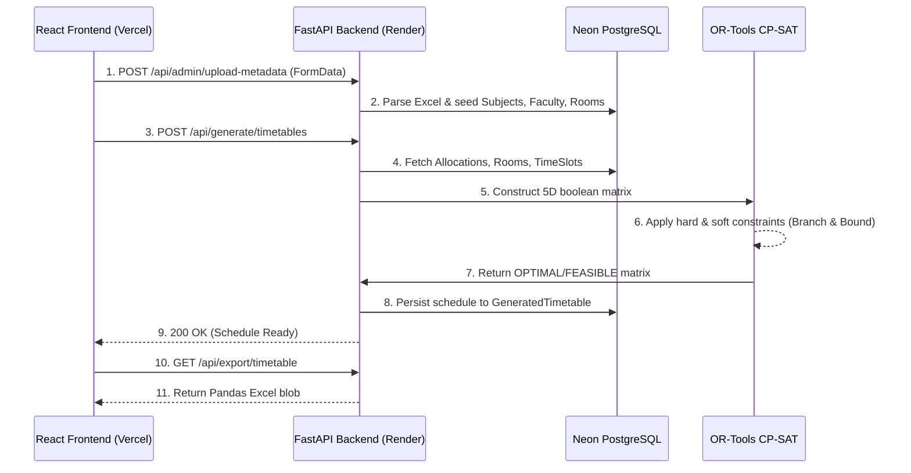

# University Timetable & Workload ERP: Architectural Deep-Dive

This document details the core architectural layers, database schema, data ingestion pipelines, and the internal mechanics of the OR-Tools CP-SAT constraint engine powering the scheduling system.

## 1. System Data Flow

The ERP operates on a strict multi-tier architecture spanning the client browser, API gateway, mathematical solver, and persistent storage.



---

## 2. Relational Database Schema

The system utilizes SQLAlchemy ORM with a PostgreSQL backend (Neon). The schema is highly normalized to prevent data anomalies.

### Core Entities

- **`users`**: Controls RBAC. 
  - Fields: `id`, `username`, `password_hash`, `role` (Enum: `ADMIN`, `DEAN`, `FACULTY`), `faculty_id`.
- **`departments`**: Logical grouping for faculty and subjects.
  - Fields: `id`, `name`, `programme_scope`.
- **`faculty`**: The teaching staff.
  - Fields: `id`, `user_id` (FK), `name`, `designation`, `max_theory_hrs`, `max_lab_hrs`.
- **`subjects`**: The curriculum entities.
  - Fields: `id`, `department_id`, `course_code`, `course_name`, `programme`, `regulations`, `semester`, `category` (Theory, Lab, Elective, Project).
- **`rooms`**: Physical infrastructure.
  - Fields: `id`, `number`, `is_lab`, `capacity`.
- **`workload_allocations`**: The critical mapping table tying Faculty to Subjects for a specific Class Section.
  - Fields: `id`, `faculty_id`, `subject_id`, `class_section`, `theory_hours`, `practical_hours`.
- **`time_slots`**: The temporal grid configuration.
  - Fields: `id`, `day_of_week`, `period_number`, `is_break`.

---

## 3. OR-Tools Matrix Construction Logic

The scheduling engine utilizes Google's **CP-SAT (Constraint Programming - Boolean Satisfiability)** solver.

### 3.1 Decision Variables (The 5D Matrix)

For every combination of `(Allocation, Day, Period, Room)`, the solver creates a set of Boolean variables (`0` or `1`):

1. **`assign[a][d][p][r]`**: Is Allocation `a` taking place on Day `d`, Period `p`, in Room `r`?
2. **`theory[a][d][p][r]`**: Is this specific assignment a Theory hour?
3. **`prac[a][d][p][r]`**: Is this specific assignment a Practical (Lab) hour?

**Base Identity Constraint:**  
An assignment is strictly either theory or practical.
`assign == theory + prac`

### 3.2 The Contiguous Lab Block Mechanism

Laboratory sessions require **2 contiguous hours**. We cannot assign one lab hour in Period 1 and the next in Period 4. To solve this mathematically without iterating arrays (which CP-SAT cannot do natively), we introduce a shifting window variable:

4. **`prac_start[a][d][p][r]`**: A boolean indicating if a practical block *initiates* at this exact period.

**The Mechanical Constraint:**
```python
# For any given period (p), the practical variable is the sum of a block starting NOW, 
# or a block that started in the PREVIOUS period (p-1).
prev_start = prac_starts[a][d][p-1][r]
curr_start = prac_starts[a][d][p][r]

model.Add(prac[a][d][p][r] == curr_start + prev_start)
```
This algebraic trick strictly enforces that if `prac_start` triggers at Period 2, then `prac` becomes `1` for Period 2 (`curr_start=1`) AND Period 3 (`prev_start=1`). 

**Fulfillment:**
To satisfy the total `practical_hours`, the solver simply counts the triggers. Since each trigger covers 2 hours, we divide the requirement by 2:
`sum(prac_starts) == practical_hours // 2`

### 3.3 Core Hard Constraints

Hard constraints represent physical impossibilities. If they cannot be met, the solver returns `INFEASIBLE`.

1. **Faculty Cloning (Overlap):** A faculty member cannot be in two rooms at once.
   `sum(assign[a]) <= 1` across all rooms/allocations belonging to `faculty_id` for a specific `(d, p)`.
2. **Class Overlap:** A class section (e.g., "CSE-A") cannot attend two subjects at once.
   `sum(assign[a]) <= 1` across all allocations belonging to a specific `class_section`.
3. **Room Occupancy:** A physical room can host at most one allocation per period.
   `sum(assign[a]) <= 1` across all allocations for a specific `(r, d, p)`.
4. **Break Periods:** The solver forces `assign == 0` if the `(d, p)` tuple exists in the `is_break` lookup map.
5. **Theory Distribution:** To prevent student fatigue, a subject cannot be taught more than 2 hours per day.
   `sum(theory[a][p][r]) <= 2` for a single day `d`.
6. **Faculty Free Slot:** Every faculty member must have at least 1 completely free slot in their week to prevent burnout.
   `total_assignments <= (num_days * num_periods) - 1`

### 3.4 Elective Synchronization (Joint Scheduling)

Elective subjects pose a unique architectural challenge: students in the same semester choose different subjects, meaning **all electives for a specific semester must be scheduled in parallel during the exact same period**.

**The Mechanical Constraint:**
We group all allocations where `Subject.category == "Elective"` by their `semester`. We then pick the first elective in the group (`alloc1`) and bind its assignment sum to every other elective (`allocN`) in that group.
```python
b1 = sum(assignments[alloc1.id][d][p][r.id]) # Is elective 1 scheduled here?
b2 = sum(assignments[alloc2.id][d][p][r.id]) # Is elective 2 scheduled here?
model.Add(b1 == b2) # Force them to occur together
```

### 3.5 Objective Function (Soft Constraints)

Soft constraints do not invalidate the schedule, but the solver will search the mathematical branch tree to minimize their occurrences using a penalty array.

- **First/Last Hour Fatigue:** We penalize scheduling theory classes in the very first period of the day and the very last period of the day.
- Every time `theory[a][d][first_period][r]` or `theory[a][d][last_period][r]` resolves to `1`, we add it to a `penalties` array.
- The solver executes: `model.Minimize(sum(penalties))`

---

## 4. Error Handling & Infeasibility

If a user uploads a configuration that is mathematically impossible (e.g., 40 hours of workload assigned to a 35-hour week), the CP-SAT solver completes its branch-and-bound tree and returns an `INFEASIBLE` state. 

The FastAPI layer intercepts this natively, destroying the matrix in memory and bubbling a `400 Bad Request` to the frontend `api.ts` Axios interceptor. The React UI then catches this rejection and renders a human-readable Toast notification warning the Admin to adjust the constraints, preventing system crashes or infinite loops.
